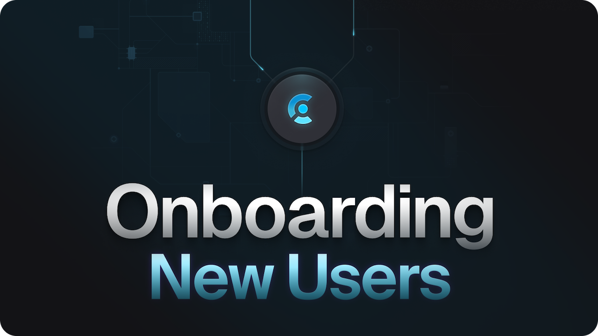

<p align="center">
  <a href="https://clerk.com?utm_source=github&utm_medium=clerk_docs" target="_blank" rel="noopener noreferrer">
   <picture>
      <source media="(prefers-color-scheme: dark)" srcset="./public/clerk-logo-white.png">
      
    </picture>
  </a>
  <br />
</p>
<div align="center">
  <h1>
   Onboarding using Clerk (Sample App)
  </h1>
  <a href="https://www.npmjs.com/package/@clerk/clerk-js">
    
  </a>
  <a href="https://discord.com/invite/b5rXHjAg7A">
    
  </a>
  <a href="https://twitter.com/clerkdev">
    
  </a> 
  <br />
  <br />
  
</div>

## Introduction

Clerk is a developer-first authentication and user management solution. It provides pre-built React components and hooks for sign-in, sign-up, user profile, and organization management. Clerk is designed to be easy to use and customize, and can be dropped into any React or Next.js application.

The user onboarding flow plays a crucial role in your application development journey, and Clerk significantly simplifies this process with built-in tooling like [customizable session data](https://clerk.com/docs/users/metadata#public-metadata), [middleware](https://clerk.com/docs/references/nextjs/auth-middleware#auth-middleware) in the [Next.js SDK](https://clerk.com/docs/references/nextjs/overview).

This repo is a working implementation of a full stack Next.js app showcasing how to leverage Clerk for your user onboarding flow and includes the following:

- Fully functional auth flow leveraging the Account Portal 
- Hooks for accessing user data and authentication state
- Customized clerkMiddleware to leverage state for redirect


## Demo

A hosted demo of this example is available at [https://clerk-nextjs-demo-app-router.clerkpreview.com/](https://sample-onboarding-app.clerkpreview.com/) 

## Running the template

```bash
git clone https://github.com/clerk/clerk-nextjs-onboarding-sample-app 
```

To run the example locally, you need to:

1. Sign up for a Clerk account at [https://clerk.com](https://dashboard.clerk.com/sign-up?utm_source=github&utm_medium=template_repos&utm_campaign=onboarding_sample_app).
2. Go to the [Clerk dashboard](https://dashboard.clerk.com?utm_source=github&utm_medium=template_repos&utm_campaign=onboarding_sample_app) and create an application.
3. Set the required Clerk environment variables as shown in [the example `env` file](./.env.template).
4. `npm install` the required dependencies.
5. `npm run dev` to launch the development server.

## Learn more

To learn more about Clerk and Next.js, check out the following resources:
 
- [Quickstart: Get started with Next.js and Clerk](https://clerk.com/docs/quickstarts/nextjs?utm_source=github&utm_medium=template_repos&utm_campaign=onboarding_sample_app)
- [Clerk Documentation](https://clerk.com/docs?utm_source=github&utm_medium=template_repos&utm_campaign=onboarding_sample_app)
- [Next.js Documentation](https://nextjs.org/docs)

## Found an issue?

If you have found an issue with our documentation, please create an [issue](https://github.com/clerk/clerk-nextjs-onboarding-sample-app/issues).

If it's a quick fix, such as a misspelled word or a broken link, feel free to skip creating an issue.  
Go ahead and create a [pull request](https://github.com/clerk/clerk-nextjs-onboarding-sample-app/pulls) with the solution. :rocket:


## Connect with us

You can discuss ideas, ask questions, and meet others from the community in our [Discord](https://discord.com/invite/b5rXHjAg7A).

If you prefer, you can also find support through our [Twitter](https://twitter.com/ClerkDev), or you can [email](mailto:support@clerk.com) us!
